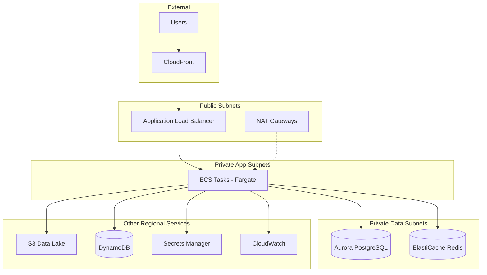

# High-Level Design (HLD) - FinTech Global Platform

## System Architecture

## Security Design
- **Network Segmentation**: Public, Private App, and Private Data subnets.
- **Encryption**: KMS-based encryption at rest for S3, RDS, DynamoDB, and Secrets.
- **IAM**: Least-privilege roles for ECS Task Execution and Tasks.
- **Compliance**: Lifecycle policies for S3 to meet 7-year retention requirements.
