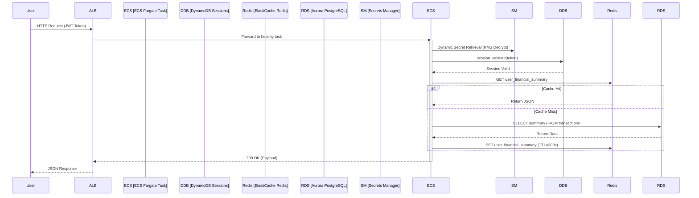
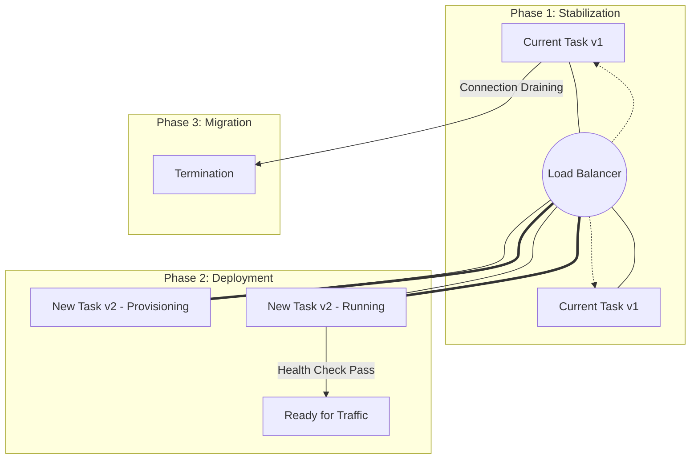

# Runtime Behavior & Execution Flow - FinTech Global Platform

This document provides a detailed breakdown of the platform's operational dynamics at runtime. It focuses on the steady-state behavior of the system, including request handling, deployment strategies, observability, and compliance enforcement.

---

## 1. Request Execution Lifecycle

The platform employs a high-performance, low-latency execution path for transactional requests. All incoming traffic is routed via an **Application Load Balancer (ALB)** to the containerized **ECS Fargate** tasks.

### Core Data Flow
1.  **Ingress**: SSL/TLS is terminated at the ALB. Traffic is verified against WAF rules (optional extension) and routed to a target group.
2.  **Auth & Session Validation**: The application retrieves the session token from the `Authorization` header and validates it against **Amazon DynamoDB**. This ensures low-latency session checks without impacting the relational database.
3.  **Secret Resolution**: At startup and runtime, the application uses its **IAM Task Role** to fetch sensitive keys (Stripe API, SendGrid) from **AWS Secrets Manager**. Database credentials are also injected securely into the environment.
4.  **Application Logic**: The Python core processes the business logic, using **X-Ray SDK** to instrument segments for tracing.

### Caching Strategy (ElastiCache Redis)
To achieve sub-200ms response times, a **Write-Around / Cache-Aside** strategy is implemented:
*   **Cache Hit**: Application checks Redis. If data is present, it is returned immediately.
*   **Cache Miss**: Application queries **Amazon Aurora**. Result is then set in Redis with a pre-defined TTL (Time-To-Live).

---

## 2. Runtime Deployment & Traffic Shifting

The platform adheres to **Immutable Infrastructure** principles. Tasks are never patched in place; instead, they are replaced by new containers during deployments.

### Rolling Update Strategy
1.  **Task Provisioning**: ECS spins up new tasks (`v-Next`) alongside the current tasks (`v-Current`).
2.  **Health Check Period**: The ALB conducts health checks against the `/health` endpoint of the new targets.
3.  **Traffic Gradual Shift**: Once healthy, the ALB begins routing a percentage of traffic to the new tasks.
4.  **Connection Draining**: Old tasks enter a draining state, completing active requests before being terminated.

---

## 3. Observability & Self-Healing

The runtime environment maintains a continuous feedback loop between execution and health monitoring.

### Telemetry Stack
*   **Logging**: STDOUT/STDERR logs from containers are captured by the `awslogs` driver and streamed to **CloudWatch Logs**.
*   **Metrics**: Custom and system metrics (CPU, Memory, RequestCount, TargetResponseTime) are aggregated in **CloudWatch**.
*   **Distributed Tracing**: The **X-Ray Daemon** sidecar collects trace data via UDP, providing a complete map of service-to-service calls.

### Self-healing Mechanisms
*   **Task Level**: ECS automatically restarts tasks that fail health checks or exit with non-zero codes.
*   **Service Level**: **Target Tracking Scaling Policies** monitor CPU utilization at the 70% threshold. If exceeded, ECS provisions additional tasks automatically to handle the load.
*   **Alarm Actions**: High-priority alarms trigger **Amazon SNS** topics to notify On-Call Engineers.

---

## 4. Governance, Security & Compliance

Even at runtime, the system is under constant audit and policy enforcement.

| Component | Runtime Behavior | Purpose |
| :--- | :--- | :--- |
| **AWS Config** | Detects drift from the defined baseline (e.g., encryption disabled). | Continuous Policy Enforcement |
| **CloudTrail** | Logs every API call made by developers or system roles. | Traceability & Forensic Audit |
| **KMS** | Every Data Storage Read/Write involves a transparent KMS decrypt/encrypt. | Data Security at Rest |
| **VPC Endpoints** | Traffic to S3/ECR/Secrets never leaves the AWS private network. | Network Perimeter Integrity |

---

## 5. Runtime Characteristics Summary

| Feature | Characteristic | Benefit |
| :--- | :--- | :--- |
| **Deployment Mode** | Rolling Update (Immutable) | Zero-downtime, safe rollbacks. |
| **Network Security** | VPC Isolated (No Public IPs) | Reduced attack surface. |
| **Scalability** | Horizontal (ECS) / Vertical (Aurora) | Handles 10k+ concurrent requests. |
| **Consistency** | ACID (Aurora) / Latency (Redis/DDB) | Financial accuracy with speed. |
| **Compliance** | Trail/Config Enabled | SOC2 / PCI-DSS Ready. |

---

## Interview Summary (Senior DevOps Perspective)

> "Our cloud-native FinTech platform implements a robust, event-driven runtime architecture designed for high-concurrency and sub-second latency. We leverage **ECS Fargate** for immutable, serverless compute, allowing us to maintain zero-downtime rolling deployments while abstracting away the underlying infrastructure. By offloading session management to **DynamoDB** and implementing a **Cache-Aside** strategy with **Redis**, we achieve significant performance gains and reduce RDS overhead. Security is integrated into the runtime execution through granular **IAM Task Roles**, secure **KMS-backed injection** from Secrets Manager, and a **zero-trust network perimeter** enforced by VPC Endpoints. Finally, our observability loop—utilizing **CloudWatch, X-Ray, and AWS Config**—ensures that the system is not only performing as expected but is also continuously compliant and self-healing against service failures."

---
*Last Updated: 2026-01-28*
